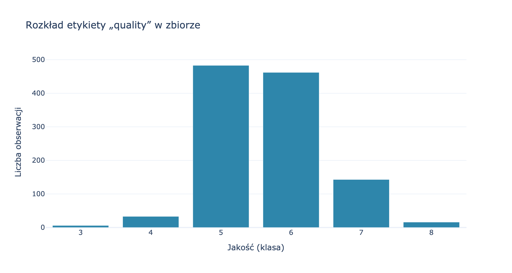
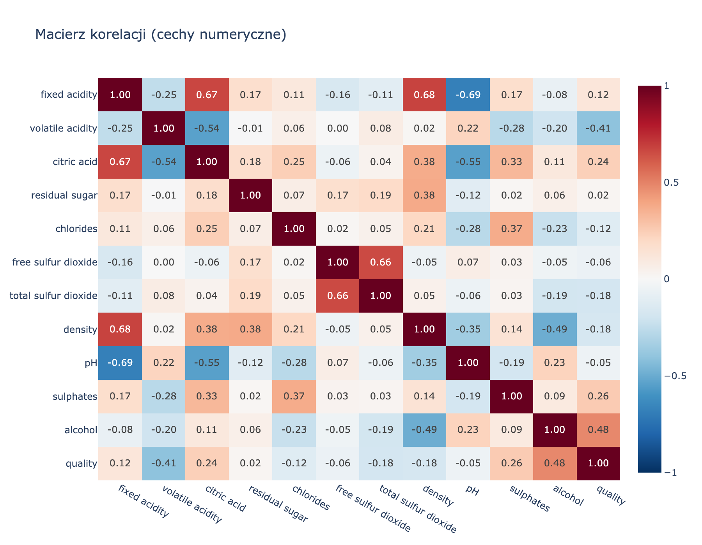
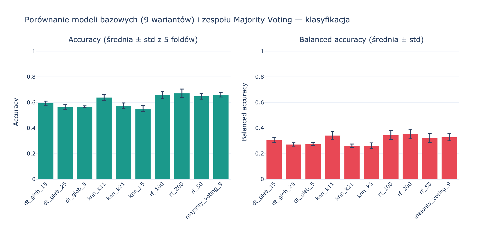
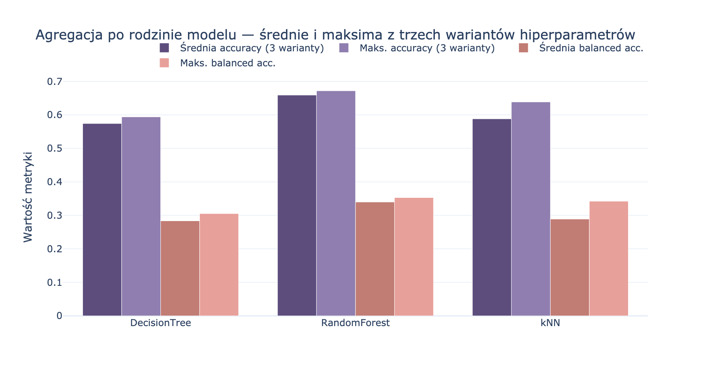
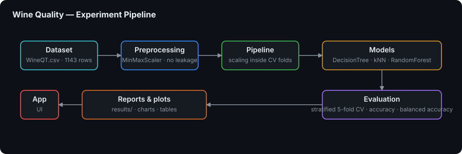

# Wine Quality Classification

> 🚀 **Multiclass wine quality classification with leakage-free scikit-learn pipelines** - compare 9 classifier variants and a majority-voting ensemble under stratified cross-validation

An end-to-end machine learning study on the [Wine Quality](https://www.kaggle.com/datasets/yasserh/wine-quality-dataset) dataset. Nine classifier variants — Decision Tree, k-NN and Random Forest, three hyperparameter settings each — are evaluated with stratified 5-fold cross-validation, alongside a `VotingClassifier` ensemble that aggregates all nine by majority vote.

The project is built around methodological rigour rather than leaderboard chasing: every scaler lives **inside** a `Pipeline` so it can never see a test fold, missing data aborts the run, a single seed drives every random component, and the exact library versions are written to disk with the results. A Streamlit walkthrough presents the study, the glossary, the LaTeX tables and the interactive charts.


---

## 🎯 Key Features

- 🍷 **Multiclass target** — classifies the `quality` label (scores 3–8) on `data/WineQT.csv`, an intentionally imbalanced real-world distribution.
- 🌳 **Nine classifier variants** — `DecisionTreeClassifier`, `KNeighborsClassifier` and `RandomForestClassifier`, three hyperparameter settings each, for a readable family-vs-family comparison.
- 🗳️ **Majority-voting ensemble** — a `VotingClassifier` with `voting="hard"` over the same nine pipelines, evaluated under identical folds.
- 🔒 **Leakage-free by construction** — `MinMaxScaler` sits inside a `ColumnTransformer` within each `Pipeline`, so it is fitted only on the training fold.
- 📏 **Two metrics, deliberately** — `accuracy` plus `balanced_accuracy` (mean per-class recall), because accuracy alone flatters a model on imbalanced wine scores.
- 🎲 **Reproducible runs** — one seed (`RANDOM_STATE = 42`) shared by every estimator and by `StratifiedKFold`, with library versions recorded per run.
- 📄 **Publication-ready export** — results are written as CSV **and** LaTeX (`pandas.DataFrame.to_latex`) for direct inclusion in a report.
- 📊 **Interactive Streamlit app** — four tabs covering the study description, requirements mapping, EDA and results, including a `.tex` preview.

---

## 📊 Results & Visualizations

All charts below are produced by `python run_experiment.py` and written to `results/`. Interactive Plotly versions of the same figures are saved as standalone HTML under `results/wykresy/`.

| Class distribution | Correlation matrix |
|---|---|
|  |  |

| Model comparison | Family aggregates |
|---|---|
|  |  |

Numeric results live in `results/wyniki_szczegolowe.csv` (per-model means and standard deviations) and `results/wyniki_agregaty_rodzin.csv` (per-family aggregates), with matching `.tex` tables beside them.

---

## 🏗️ Pipeline



### Protection against data leakage

All scaling operations are performed **inside** a scikit-learn `Pipeline` object:

```
Pipeline([
    ("preprocess", ColumnTransformer([("num", MinMaxScaler(), feature_cols)])),
    ("clf", classifier),
])
```

Thanks to this, `MinMaxScaler` is **fitted exclusively on the training fold** — it never "sees" the test data before evaluation. Passing a ready `Pipeline` to `cross_validate` guarantees this automatically for each of the 5 splits. Details: [scikit-learn — Common pitfalls](https://scikit-learn.org/stable/common_pitfalls.html).

### No missing data

The `wczytaj_pelna_ramke` function in `src/experiment.py` calls `df.isna().any().any()` and raises an exception if it finds missing values — the experiment will not run on an incomplete dataset.

### Reproducibility

In line with the requirement [scikit-learn — Getting reproducible results](https://scikit-learn.org/stable/common_pitfalls.html):

- One fixed seed: `RANDOM_STATE = 42` in `src/config.py`; passed to every classifier (`random_state`) and to `StratifiedKFold(shuffle=True, random_state=RANDOM_STATE)`.
- `StratifiedKFold` with `shuffle=True` requires a seed — without it the sample order after shuffling would differ on every run.
- The same `cv` object is passed to each `cross_validate` call, which guarantees identical splits for all models.
- The `results/wersje_bibliotek.txt` file records the versions of scikit-learn, numpy and pandas when the results are generated — making it possible to reproduce the environment.

---

## 🧩 Models Under Comparison

| Family | Variants | Hyperparameters |
|---|---|---|
| **DecisionTree** | `dt_gleb_5`, `dt_gleb_15`, `dt_gleb_25` | `max_depth` 5 / 15 / 25 with `min_samples_leaf` 2 / 5 / 10 |
| **kNN** | `knn_k5`, `knn_k11`, `knn_k21` | `n_neighbors` 5 / 11 / 21, `weights` uniform / distance / uniform |
| **RandomForest** | `rf_50`, `rf_100`, `rf_200` | `n_estimators` 50 / 100 / 200 with `max_depth` 10 / 15 / 20 |
| **Ensemble** | `majority_voting_9` | `VotingClassifier(voting="hard")` over all nine pipelines above |

Validation is identical for every row: `StratifiedKFold(n_splits=5, shuffle=True, random_state=42)`, scored on `accuracy` and `balanced_accuracy` via `cross_validate`.

---

## 🛠️ Technology Stack

### Machine Learning
- **scikit-learn** (`>=1.3,<2`) — `Pipeline`, `ColumnTransformer`, `MinMaxScaler`, the three classifier families, `VotingClassifier`, `StratifiedKFold`, `cross_validate`
- **NumPy** (`>=1.24,<3`) — numeric aggregation of fold scores

### Data & Reporting
- **pandas** (`>=2.0,<3`) — data loading, `groupby` aggregation, CSV export and `to_latex` table generation

### Visualization & UI
- **Plotly** (`>=5.18,<6`) — all four figures, exported as interactive standalone HTML
- **Streamlit** (`>=1.28,<2`) — the four-tab study walkthrough

---

## 🚀 Getting Started

### Prerequisites

- **Python 3.10+** (recommended)
- **pip** and the ability to create a virtual environment

### 1. Clone the Repository

```bash
git clone https://github.com/dawidolko/WineQuality-Classifier-Python.git
cd WineQuality-Classifier-Python
```

### 2. Install Dependencies

```bash
pip install -r requirements.txt
```

### 3. Run

Run the experiment on its own — it writes CSV, `.tex`, `wersje_bibliotek.txt` and the HTML charts in `results/wykresy/`:

```bash
python run_experiment.py
```

Launch the Streamlit application:

```bash
streamlit run streamlit_app.py
```

#### One-command start scripts

The **`start.sh`** (Linux/macOS) and **`start.bat`** (Windows) scripts run, in order:

1. venv + `pip install -r requirements.txt`
2. `python run_experiment.py`
3. `streamlit run streamlit_app.py` → usually `http://localhost:8501`

```bash
chmod +x start.sh
./start.sh
```

```cmd
start.bat
```

### Application tabs

| Tab | Content |
|----------|--------|
| **Project description** | Study goal, experiment flow (what → why → effect), glossary of terms, requirements compliance, **LaTeX file preview** |
| **Requirements & methodology** | Table: requirement → implementation in code / files |
| **Dataset (EDA)** | `quality` class distribution, correlation matrix, data preview |
| **Classification results** | CV metric charts, tables, preview and download of results |

---

## 📁 Project Structure

```
WineQuality-Classifier-Python/
├── 📊 data/
│   └── WineQT.csv                     # Source dataset (Kaggle / yasserh)
├── 🐍 src/
│   ├── config.py                      # Paths, seed (RANDOM_STATE = 42)
│   ├── experiment.py                  # Pipeline, CV, ensemble, CSV/LaTeX export
│   └── wykresy.py                     # Plotly charts + HTML export
├── 📈 results/                        # Generated artifacts
│   ├── img_rozkald.png                # Class distribution
│   ├── img_korelacja.png              # Correlation matrix
│   ├── img_modele.png                 # Model comparison
│   ├── img_agregaty.png               # Family aggregates
│   ├── wyniki_szczegolowe.csv/.tex    # Per-model results
│   ├── wyniki_agregaty_rodzin.csv/.tex # Per-family aggregates
│   ├── wersje_bibliotek.txt           # Library versions for reproducibility
│   └── wykresy/                       # Interactive Plotly HTML charts
├── 📚 docs/
│   ├── diagrams/pipeline.svg          # Pipeline diagram
│   ├── build_pptx.py                  # Presentation generator
│   └── Wine_Quality_Prezentacja.pptx  # Generated presentation
├── ▶️ run_experiment.py                # Command-line entry point
├── 🖥️ streamlit_app.py                 # Web application
├── 🚀 start.sh / start.bat             # Experiment + Streamlit
├── 📦 requirements.txt
└── 📖 README.md
```

### Repository structure reference

| Path | Description |
|---------|------|
| `data/WineQT.csv` | Source data |
| `src/config.py` | Paths, seed |
| `src/experiment.py` | Pipeline, CV, ensemble, CSV/LaTeX export, chart invocation |
| `src/wykresy.py` | Plotly charts + HTML export |
| `run_experiment.py` | Command-line entry point |
| `streamlit_app.py` | Web application |
| `start.sh` / `start.bat` | Experiment + Streamlit |
| `results/` | Generated results (CSV, TeX, `wykresy/*.html`, `wersje_bibliotek.txt`) |

### `.gitignore`

Ignored items include `.venv/`, Python cache, and IDE files. **Generated files in `results/`** can optionally be added to the ignore list — `.gitignore` contains a ready, commented-out block with instructions.

---

## 📄 License

This project is open source and available under the terms described in the [LICENSE](LICENSE) file.

---

## 👨‍💻 Author

Created by **[Dawid Olko](https://github.com/dawidolko)**

- **Website** — [dawidolko.pl](https://dawidolko.pl/)
- **LinkedIn** — [@dawidolko](https://www.linkedin.com/in/dawidolko/)
